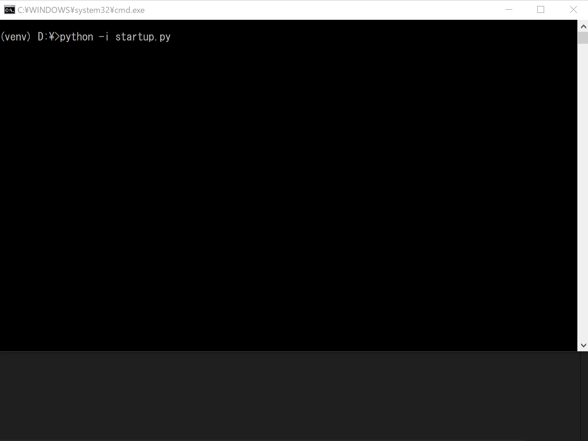

# Enhanced Interactive mode

F12 key shows help message in Python interactive mode.

## Usage

```bash
$ python -i startup.py
>>> import sample
>>> sample.A
sample.A: <class 'sample.A'>
Help for class A in module sample

class sample.A(builtins.object):
    (No document)

--------------------------------
Help for wrapper_descriptor

__init__(self, /, *args, **kwargs) unbound builtins.object method
    Initialize self.  See help(type(self)) for accurate signature.
```


